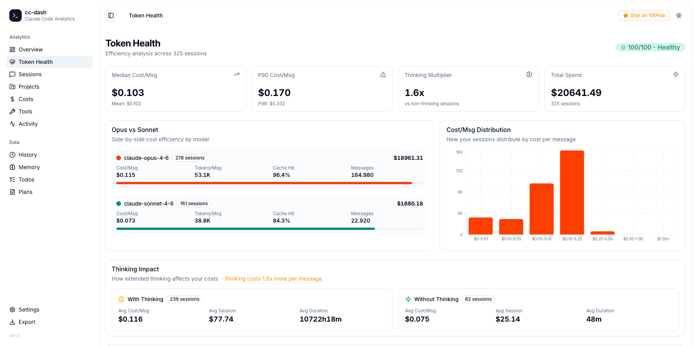

# cc-dash

A high-performance, local-first analytics dashboard for [Claude Code](https://claude.ai/code). Single binary, zero runtime dependencies.

Reads directly from `~/.claude/` - no cloud, no telemetry, no signup. Just your data.



## Quick Start

```bash
# Build from source
git clone https://github.com/whallysson/cc-dash
cd cc-dash
make build
./build/cc-dash
```

The dashboard opens automatically at `http://localhost:3000`.

## Token Health - Are you burning tokens?

Thousands of developers are reporting that Claude Code consumes tokens faster than expected ([discussion](https://x.com/lydiahallie/status/2038686571676008625)). But without data, it's just a feeling.

cc-dash's **Token Health** page gives you the numbers:

- **Cost per message** - mean, median, P90, P99, and outlier detection
- **Opus vs Sonnet** - side-by-side cost/msg, tokens/msg, and cache hit rate per model
- **Thinking Impact** - how much more extended thinking costs vs non-thinking sessions (multiplier)
- **Vampire Sessions** - top 10 most expensive sessions with full drill-down
- **Cache Efficiency** - sessions where the prompt cache failed, wasting input tokens
- **Health Score** - 0-100 composite score based on cache rates, thinking overhead, and cost outliers

This is the page that answers: "Am I spending too much, or is this normal?"

## Why cc-dash?

Existing tools re-scan all JSONL files on every HTTP request. With hundreds of sessions and gigabytes of data, that means multi-second page loads and constant disk I/O.

cc-dash takes a different approach:

- **Parse once, serve from memory.** All session data is indexed at startup and served in <1ms per request.
- **Incremental updates.** File watcher detects changes and re-parses only what changed.
- **SQLite cache.** Subsequent startups skip unchanged files entirely.
- **WebSocket push.** No polling — the browser updates instantly when new data arrives.
- **Single binary.** The entire frontend is embedded via `go:embed`. No `npm install`, no `node_modules`, no dev server.

### Benchmarks (real-world, 1585 JSONL files / 1.7 GB)

| Metric | cc-dash |
|--------|---------|
| Cold start (first run) | 520ms |
| Warm start (cached) | **28ms** |
| API response time | <1ms |
| Memory usage | ~72 MB |
| Binary size | 11 MB |
| Frontend (gzipped) | 90 KB |

## Features

### 15 Dashboard Pages

| Page | Description |
|------|-------------|
| **Overview** | Token usage over time, project activity, peak hours, model breakdown, recent sessions |
| **Token Health** | Cost/msg stats, Opus vs Sonnet comparison, thinking impact, vampire sessions, cache efficiency, health score |
| **Sessions** | Searchable/sortable table with server-side pagination. Feature badges (thinking, agents, MCP, compaction) |
| **Session Replay** | Full conversation view — user turns, assistant responses, thinking blocks, tool calls with expand/collapse |
| **Projects** | Card grid with sessions, cost, duration, top tools. Click through to project detail |
| **Costs** | Daily cost chart, cost by project bars, per-model breakdown with correct pricing, cache efficiency panel |
| **Tools** | Tool ranking by category (file-io, shell, agent, web, planning, mcp), feature adoption rates |
| **Activity** | GitHub-style contribution heatmap, current/longest streak, day-of-week patterns, peak hours |
| **History** | Searchable command history from `history.jsonl` |
| **Memory** | Browse and view memory files across all projects, filterable by type |
| **Todos** | View todo items with status indicators |
| **Plans** | Read plan files with inline content display |
| **Settings** | Inspect `settings.json`, hooks, installed plugins |
| **Export** | Download all session data as JSON |

### Architecture

```
~/.claude/                          cc-dash
├── projects/                       ┌──────────────────────┐
│   └── <slug>/                     │  Concurrent Scanner  │
│       └── *.jsonl  ──fsnotify──▶  │  (goroutine pool)    │
├── stats-cache.json                │         │             │
├── history.jsonl                   │    In-Memory Index    │
├── plans/                          │    (RWMutex maps)     │
├── todos/                          │         │             │
├── memory/                         │   HTTP API (<1ms)     │
└── settings.json                   │   WebSocket push      │
                                    │         │             │
                                    │  Embedded SPA ────────▶ Browser
                                    │  (go:embed, 90KB gz)  │
                                    │         │             │
                                    │  SQLite Cache         │
                                    │  (warm start: 28ms)   │
                                    └──────────────────────┘
```

### Key Optimizations

**`peekType` — skip 50-60% of lines without JSON parsing:**

Most JSONL lines are `progress` or `file-history-snapshot` events with large payloads irrelevant to the index. Instead of `json.Unmarshal` on every line, `peekType` uses `bytes.Contains` to detect the line type and skip non-essential lines entirely. This reduces JSON parsing volume by half.

**Per-model cost calculation:**

Each assistant turn contains the actual model used (`claude-opus-4-6`, `claude-sonnet-4-6`, etc.). cc-dash tracks token usage per model per session and applies the correct pricing — instead of assuming the most expensive model for everything.

**Incremental parsing:**

The scanner tracks byte offsets per file. When a file grows (active session), only the new bytes are parsed. Combined with SQLite-cached file mtimes, warm starts process zero bytes if nothing changed.

## Data Sources

| Source | Path | Used for |
|--------|------|----------|
| Session JSONL | `~/.claude/projects/<slug>/*.jsonl` | Sessions, tokens, costs, tools, replay |
| Subagent JSONL | `~/.claude/projects/<slug>/<id>/subagents/*.jsonl` | Subagent session data |
| Stats cache | `~/.claude/stats-cache.json` | Daily activity, hour counts (enrichment) |
| Command history | `~/.claude/history.jsonl` | History page |
| Memory files | `~/.claude/projects/<slug>/memory/*.md` | Memory page |
| Plan files | `~/.claude/plans/*.md` | Plans page |
| Todo files | `~/.claude/todos/*.json` | Todos page |
| Settings | `~/.claude/settings.json` | Settings page |

## API

All endpoints return JSON. Responses are served from the in-memory index (<1ms).

```
GET  /api/stats                         Overview stats
GET  /api/sessions?page=1&limit=50&sort=date&q=...  Paginated sessions
GET  /api/sessions/{id}                 Single session
GET  /api/sessions/{id}/replay?offset=0&limit=50    Streaming replay
GET  /api/projects                      Project list
GET  /api/projects/{slug}               Project detail + sessions
GET  /api/costs                         Cost analytics (per-model)
GET  /api/tools                         Tool analytics
GET  /api/activity                      Heatmap, streaks, patterns
GET  /api/efficiency                    Token health, model comparison, vampires
GET  /api/history?limit=200&q=...       Command history
GET  /api/memory                        Memory files
PATCH /api/memory                       Update memory file
GET  /api/plans                         Plan files
GET  /api/todos                         Todo files
GET  /api/settings                      Settings + plugins
POST /api/export                        Export all data as JSON
GET  /ws                                WebSocket (live updates)
```

## Tech Stack

**Backend (Go 1.22+)**
- `net/http` — stdlib HTTP server with Go 1.22 routing patterns
- `modernc.org/sqlite` — pure-Go SQLite, no CGo, cross-compiles cleanly
- `github.com/fsnotify/fsnotify` — file system watcher
- `nhooyr.io/websocket` — production-grade WebSocket
- `go:embed` — frontend assets embedded in binary

**Frontend**
- React 19 + React Router 7
- Tailwind CSS v4 + shadcn/ui (new-york style, slate palette)
- Recharts (charts)
- Vite (build in ~170ms)
- Lucide React (icons)

## Building

### Prerequisites

- Go 1.22+
- Bun (for frontend build)

### Commands

```bash
make build          # Build frontend + backend
make run            # Build and run
make dev            # Run with go run (dev mode)
make build-all      # Cross-compile (darwin/linux, amd64/arm64)
make install        # Install to PATH
make clean          # Remove build artifacts
```

### Cross-compilation

```bash
make build-all
# Produces:
#   build/cc-dash-darwin-arm64
#   build/cc-dash-darwin-amd64
#   build/cc-dash-linux-amd64
#   build/cc-dash-linux-arm64
```

No CGo required — `modernc.org/sqlite` is pure Go, so cross-compilation works out of the box.

## CLI Options

```
cc-dash [flags]

Flags:
  --port int          HTTP port (default: 3000, auto-finds free port)
  --claude-dir string Path to Claude data directory (default: ~/.claude)
  --no-browser        Don't open browser automatically
  --version           Show version
```

## Project Structure

```
cc-dash/
├── cmd/cc-dash/main.go          CLI entry point
├── internal/
│   ├── index/                   In-memory session index
│   │   ├── index.go             Central index (RWMutex maps, aggregations)
│   │   ├── parser.go            JSONL parser with peekType optimization
│   │   ├── scanner.go           Concurrent file discovery + parsing
│   │   └── watcher.go           fsnotify file watcher
│   ├── model/                   Types, pricing, data readers
│   │   ├── types.go             All data structures
│   │   ├── pricing.go           Per-model pricing table
│   │   ├── readers.go           File readers (history, memory, plans, etc.)
│   │   └── tools.go             Tool category mapping
│   ├── replay/replay.go         Streaming session replay parser
│   ├── server/                  HTTP server
│   │   ├── server.go            Server setup, SPA handler, go:embed
│   │   ├── routes.go            18 API route handlers
│   │   └── websocket.go         WebSocket hub + broadcast
│   ├── store/sqlite.go          SQLite cache for warm starts
│   └── util/                    Helpers (slug decode, frontmatter)
├── frontend/                    React SPA (Vite + Tailwind v4)
│   └── src/pages/               15 page components
├── Makefile
└── go.mod                       3 direct dependencies
```

## License

MIT
